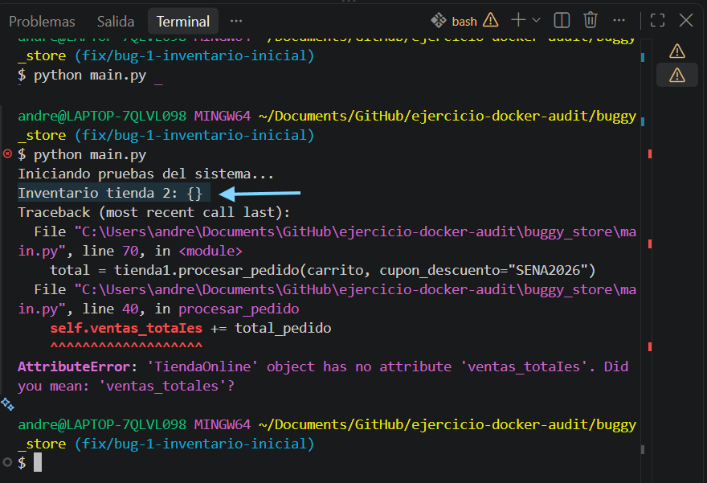

Bug 1: Valor mutable por defecto en inventario_inicial
1. ¿Cómo se encontró el error?
Durante la ejecución de las pruebas iniciales en main.py, se instanciaron dos objetos independientes: tienda1 = TiendaOnline() y tienda2 = TiendaOnline(). Al agregar el producto "P01" a tienda1, se ejecutó la línea print(f"Inventario tienda 2: {tienda2.inventario}"). La consola imprimió que tienda2 contenía el producto "P01", a pesar de que nunca se le había agregado nada, revelando que el estado de ambas instancias estaba acoplado.

2. ¿Por qué falla? (Diagnóstico técnico)
En Python, los argumentos por defecto en las funciones/métodos se evalúan una sola vez cuando el módulo es cargado, no cada vez que se llama a la función. Al definir inventario_inicial={}, se asignó un diccionario (que es un objeto mutable) en una única dirección de memoria RAM. Como resultado, todas las instancias de TiendaOnline que no reciben un parámetro explícito terminan apuntando y modificando la misma referencia en memoria.

3. ¿Cómo se solucionó?
Se reemplazó el objeto mutable por defecto {} por None (que es un valor inmutable) en la firma del constructor __init__. Dentro del método, se agregó una validación condicional: si el parámetro es None, se instancia un nuevo diccionario vacío {} exclusivo para esa instancia. De este modo, cada tienda mantiene su propia referencia de memoria independiente.
